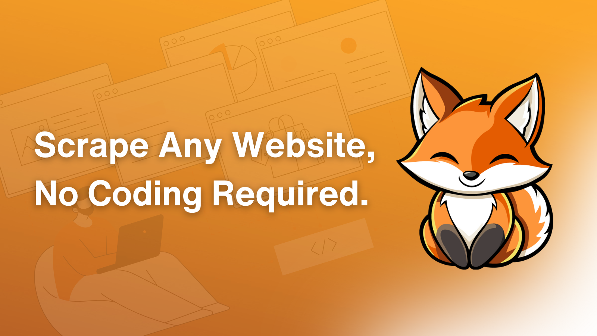

# 🦊 Welcome to FetchFox

<figure><figcaption></figcaption></figure>

### What Is Fetchfox?

FetchFox is an AI web scraper tool that grabs data from any site using plain English. You simply explain what you need, and FetchFox does the rest. It works for pulling product details, leads information, research data and much more.

What are some examples? Check below:

* Directories? Piece of cake.
* Google Maps listings? Easy-peasy.
* Social media platforms? A walk in the park.

You name it, we scrape it.

### TL;DR

What can FetchFox do?

1. **Data extraction**: Tell FetchFox what info you want (like product names, prices, or emails), and it pulls that data from the site or multiple sites.
2. **Ease of use**: No coding needed. Start with a URL and type your request in English.
3. **Wide application**: Works on any website, making it a great tool for different tasks.

### Why FetchFox?

Most web scrapers are a pain (respectfully)—they’re clunky, expensive, and overbuilt. FetchFox cuts through this noise. You start with a URL, you enter your prompt in plain English, you get your data, done. We focus on results, not headaches.

FetchFox stands on 3 key “S” pillars: Simplicity, Speed, and Savvy Savings—ensuring you grab the data you need quickly without burning a hole in your pocket.

1. **Simplicity wins**: Enter a prompt in plain language then sit back and enjoy your data.
2. **Save (more) time**: Automate data collection without the hassle and coding skills.
3. **Stellar value**: Start with 1,000 free credits (i.e., 1,000 scraped items) and enjoy pricing that’s straightforward and built to fit your needs.
