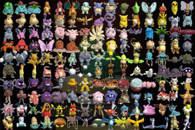

# 😎 Getting Started

To get started with FetchFox, the first step is to install the Chrome Extension, which you can find in the [Chrome Web Store](https://chromewebstore.google.com/detail/fetchfox/meieeikgpmlhmfjmjgciiclgmbcocfnk?authuser=0\&hl=en).&#x20;

<figure><figcaption>
After you install the extension, click the puzzle piece to find FetchFox
</figcaption></figure>

Once you've installed the extension, you'll be asked to choose how to use FetchFox. You can either enter your own OpenAI API key, or use the server provided by FetchFox.

If you use your own OpenAI API key, your use of FetchFox will be free forever. Additionally, only OpenAI will see your data.

If you use FetchFox's server, your use of the extension is free... for now. This option costs us money, so we will need to charge for it in the future.

<figure><figcaption>
If you enter your own API key, your use of FetchFox is free forever.
</figcaption></figure>

After choosing how to use FetchFox, you can start your first scrape.

As an example, lets scrape a list of Pokemon from Wikipedia. To do this, navigate to their [List of Pokemon](https://en.wikipedia.org/wiki/List\_of\_Pok%C3%A9mon).

<figure><figcaption>
FetchFox can scrape 'em all
</figcaption></figure>

Once you've navigated to the list, open up FetchFox. It should look like the screenshot below.

<figure><figcaption>
Our starting point to scrape Pokemon
</figcaption></figure>

Lets tell FetchFox what to scrape. FetchFox uses AI, and the more descriptive the prompt is, the better. Here's a good prompt to get started:

> Find links to pages about Pokemon. Only find links about individual Pokemon, and only find links on Wikipedia. Exclude general category links and navigation links. On each Pokemon page, find the Pokemon number, its type, and it's evolution stage as an ordinal (ie. 1st, 2nd, 3rd, ...)

Click the arrow to continue. FetchFox will generate a scrape plan for you, which you can review.

<figure><figcaption>
The scrape plan from FetchFox
</figcaption></figure>

The scrape plan takes your prompt and formats it for the scrape executor. Before clicking "Run Scrape", check the scrape plan for any mistakes the AI may have made.

In the example above, there's one small mistake. The second field has the instruction "List all types", which is unnecessary and will confuse the AI. Make sure to delete anything like that.

Once your edits are done, click **Run Scrape**.

<figure><figcaption>
The scrape is running
</figcaption></figure>

FetchFox executes scrapes in two steps:

1. **First is the crawl step.** This step looks for links related to your prompt. In the example above, this means looking for links to pages about Pokemon.
2. **Second is the extraction step.** This step visits each page from the crawl step, and looks for the data you requested.

Since there's lots of Pokemon, it would take a long time to find all the pages. To speed things up, we can stop the scraper once it found a few dozen links. Click the stop button.

<figure><figcaption>
You can stop a scrape at any point
</figcaption></figure>

We've stopped the scrape part-way through the crawl step. Lets go straight to extraction on the links we found. Click **Run Only Extraction** above.

<figure><figcaption>
FetchFox is going to each page, and extracting data from it
</figcaption></figure>

The extraction step will go through your list of links, one-by-one, until its done. Just like the crawl step, you can stop it early.

When you're done, you can export the results.

<figure><figcaption>
Two ways to get your data out: CSV or web links
</figcaption></figure>

FetchFox gives two options to export data:

1. **Download CSV** generates a file that you can save on your computer.
2. **Share Results** published your results [https://fetchfoxai.com](https://fetchfoxai.com), and also to a Google Spreadsheet.

As an example, you can view the [results of a Pokemon scrape](https://fetchfoxai.com/s/R7aYvs1fEO).
