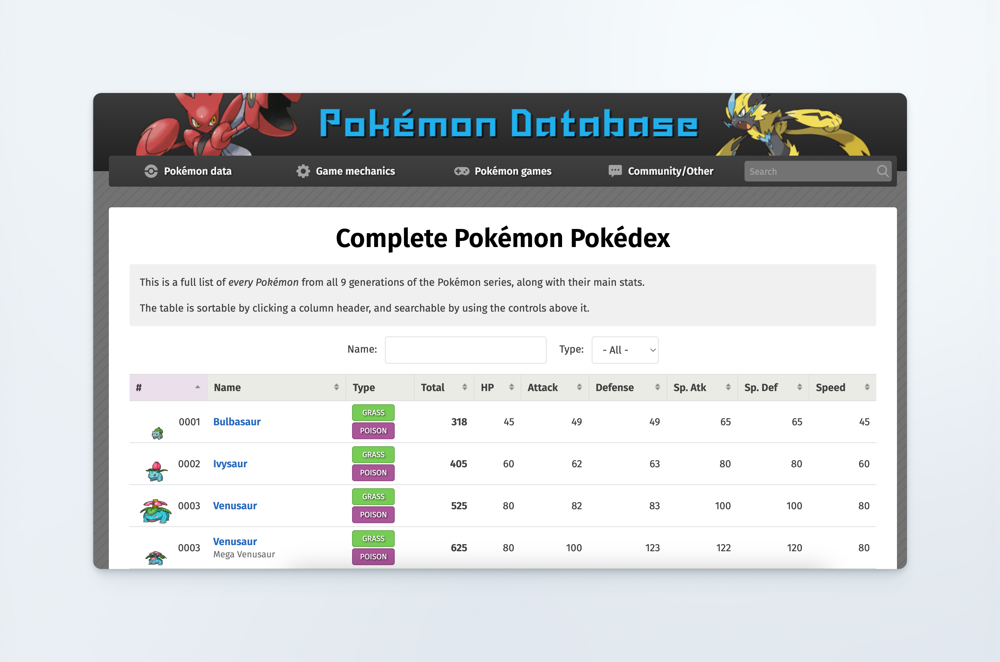
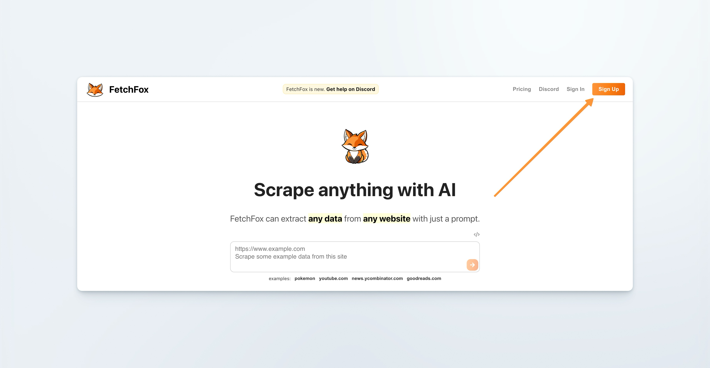
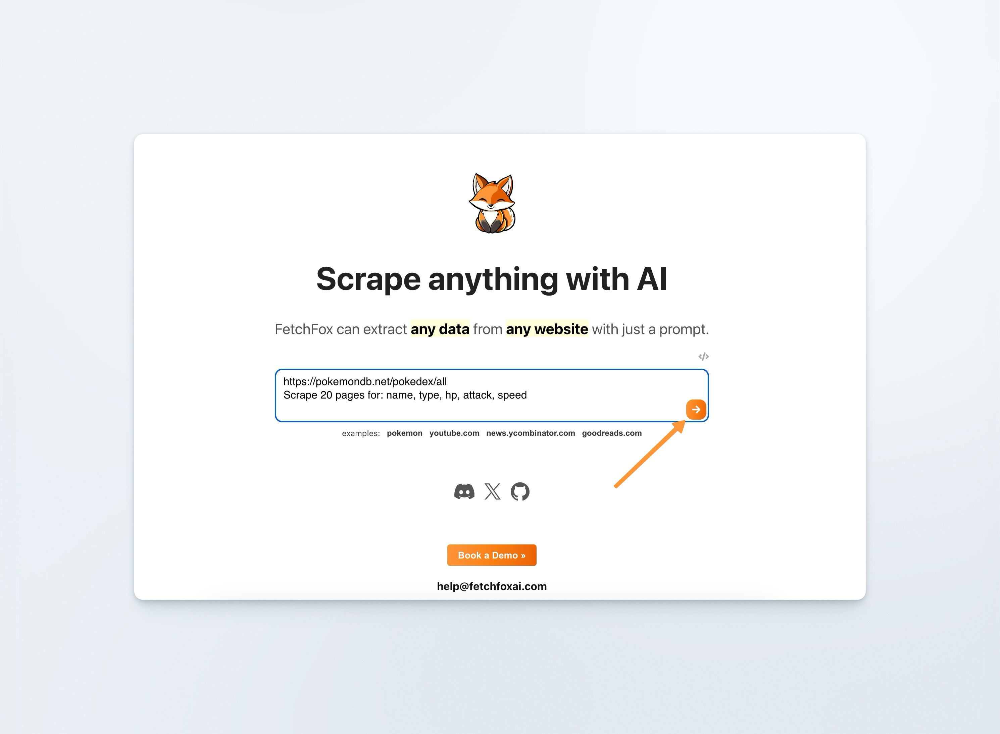
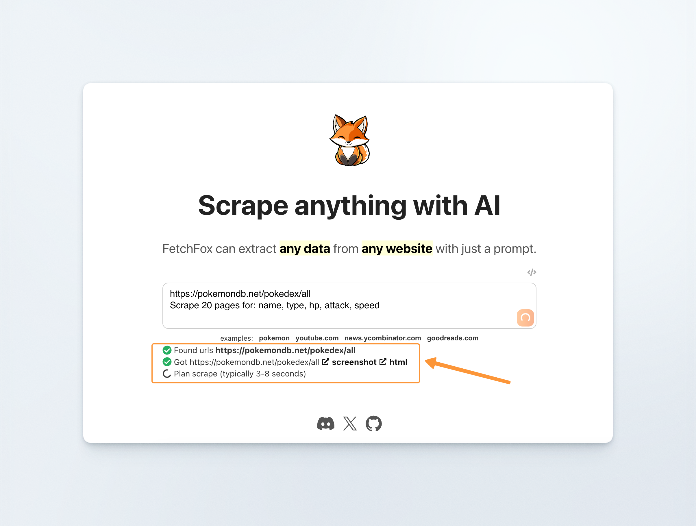
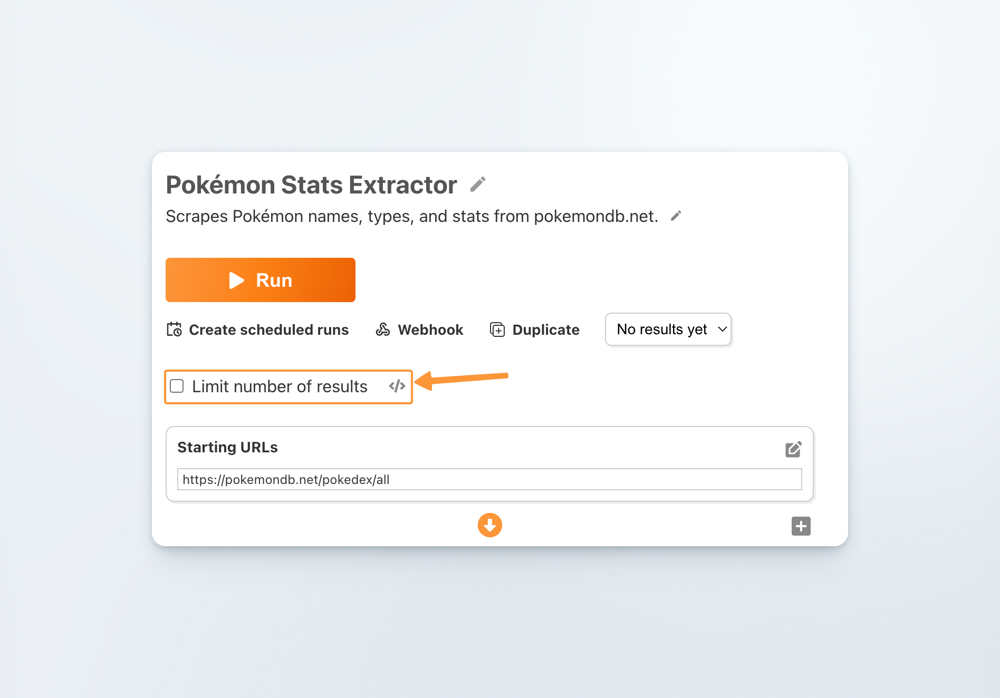
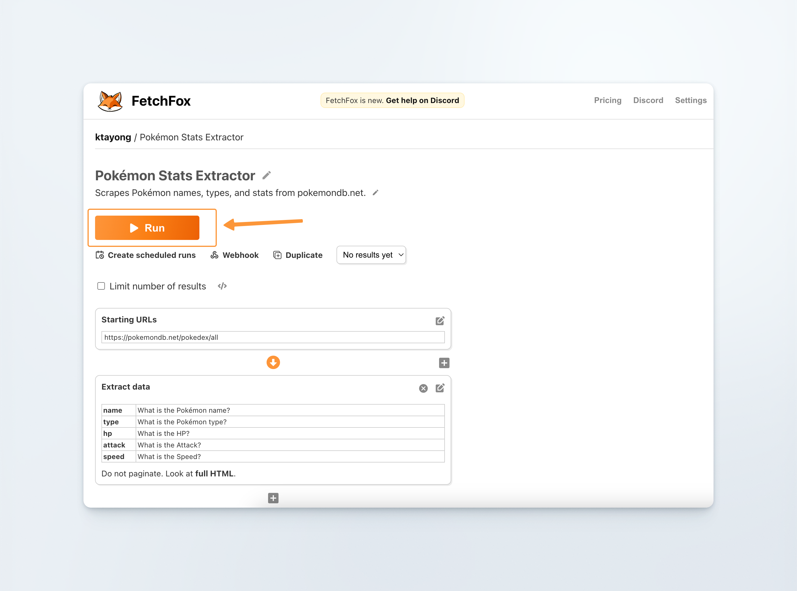
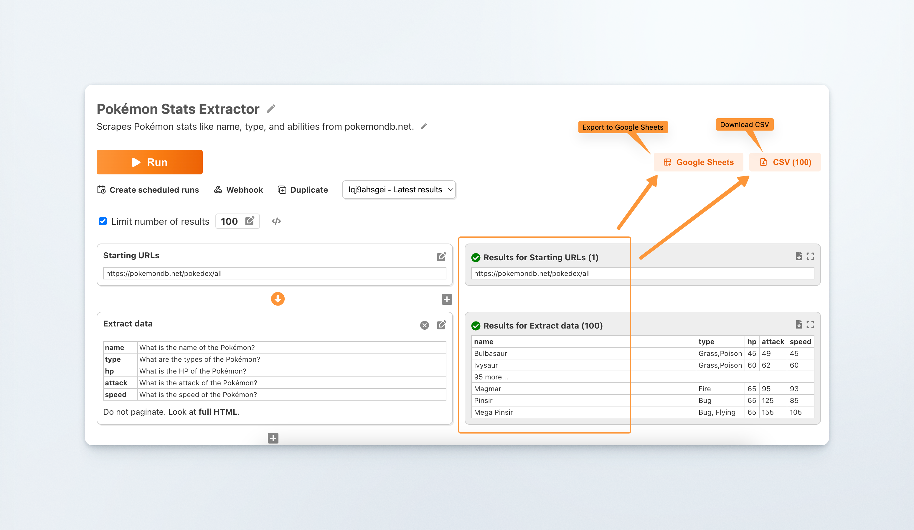

# ⚡ Quickstart (Pokémon Edition)

In this quick start guide, we'll show you how to set up a task, run it, and export your data. Grab your favorite drink 🥤 and let’s scrape some Pokémon!

<figure><figcaption></figcaption></figure>

### Step1. Sign up for an account

First things first, you need an account to extract data.&#x20;

Go ahead and sign up which takes a few seconds.

<figure><figcaption></figcaption></figure>

### Step 2. Set up the scrape

Once you’re logged in, enter this URL:

```
https://pokemondb.net/pokedex/all
```

Underneath it, enter this prompt:&#x20;

```
Scrape 100 pokemon for: name, type, and number
```

Then click on the orange arrow to “plan” the scrape (our AI gathers the information needed to run your prompt).&#x20;

<figure><figcaption></figcaption></figure>


It’ll then take a few seconds to load.


<figure><figcaption></figcaption></figure>

Next, you’ll be taken to this page below where you’ll see some additional categories.

1. Starting URLs section&#x20;
2. Find more URLs section&#x20;
3. Extract data section

You can uncheck “Limit number of results” if you don’t want to add a limit to your scrape, but keep in mind that each result costs 1 credit.

<figure><figcaption></figcaption></figure>

As for the 3 other sections, don’t worry about customizing for now because our AI has done most of the heavy lifting for you and our prompt is pretty simple to begin with.

<figure><figcaption></figcaption></figure>

All you have to do now is to click “Run”.

### Step 3. Sit back and enjoy

It’ll take a few seconds to gather the results, in this case, 100.

Once it’s done, you can export to Google Sheets or download as CSV and you’re done!

<figure><figcaption></figcaption></figure>

Congrats on completing your first scrape on FetchFox 🎉

