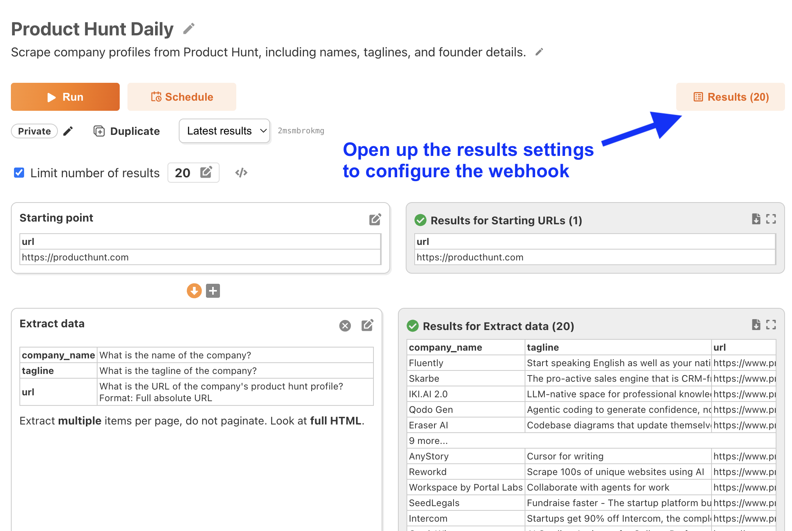
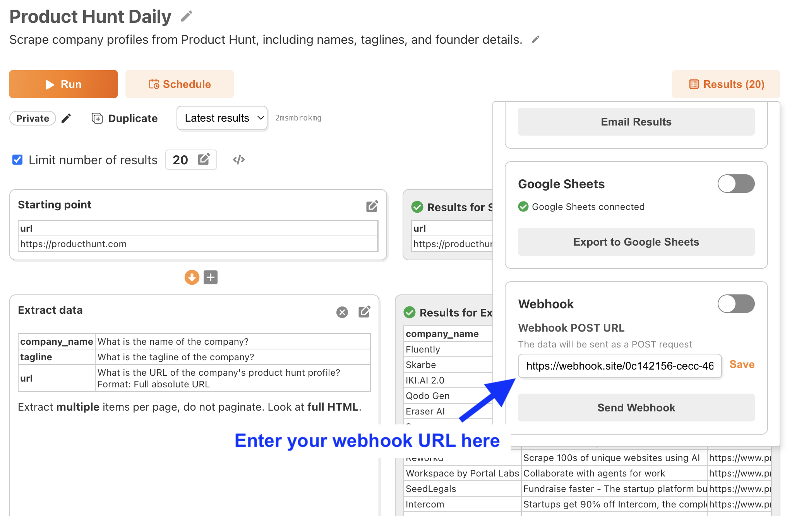
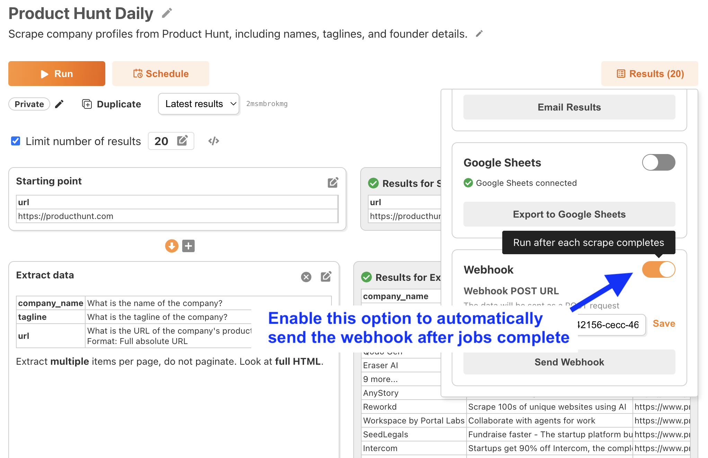

# Webhooks

You can connect FetchFox to any app that supports incoming webhooks. This is a useful way to connect to many apps that don't have a direct integration with FetchFox, including Zapier, n8n, make.com, and more.

FetchFox sends webhooks as an HTTP POST request. It sends a JSON body with an array of results, like the format below:

```
[
  {
    "company_name": "AcmeTech",
    "tagline": "Innovating the future of AI solutions",
    "url": "https://example.com/profiles/jdoe",
    "founder": "John Doe"
  },
  {
    "company_name": "DataFlow",
    "tagline": "Seamless data integration for enterprises",
    "url": "https://example.com/profiles/asmith",
    "founder": "Alice Smith"
  },
  {
    "company_name": "AcmeTech",
    "tagline": "Innovating the future of AI solutions",
    "url": "https://example.com/profiles/bjones",
    "founder": "Bob Jones"
  }
]
```

You can send one-off webhooks for testing, or configure FetchFox to send a webhook whenever a scraper finishes. Let's do both

## Setting up your webhook

To get started, go to a scraper and click the "Results" button.

<figure><figcaption><p>Click the "Results" button to send results to a webhook</p></figcaption></figure>

Scroll down to the Webhook section, put in your target URL, and click "Save".

<figure><figcaption><p>Enter your webhook URL and save it</p></figcaption></figure>

To test the webhook, click the "Send Webhook" button. This will immediately send a webhook for the latest results for your scraper.

If it looks good, you can tell FetchFox to send a webhook whenever a job complets. Just turn on the switch:

<figure><figcaption><p>Turn on the switch to send webhooks after each scraper completes.</p></figcaption></figure>

This option is especially useful if you want to use webhooks in combination with scheduled jobs.
