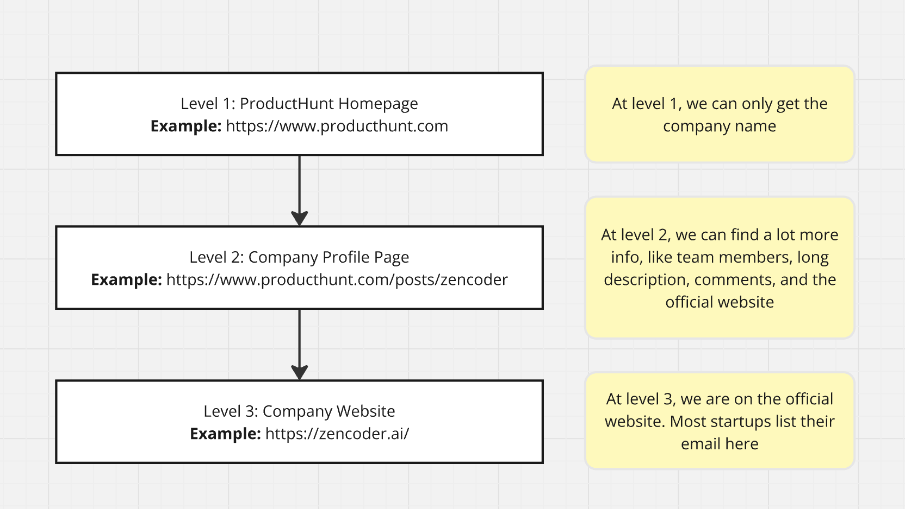
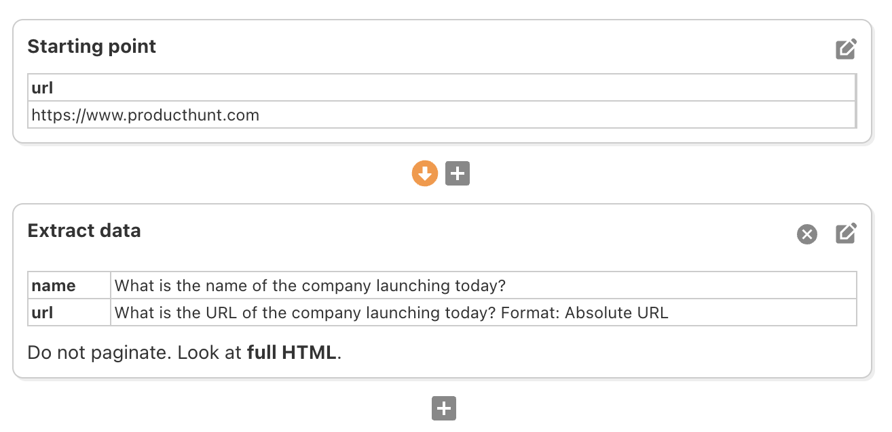
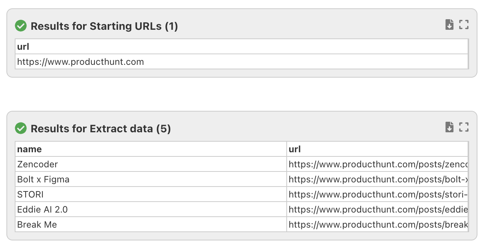
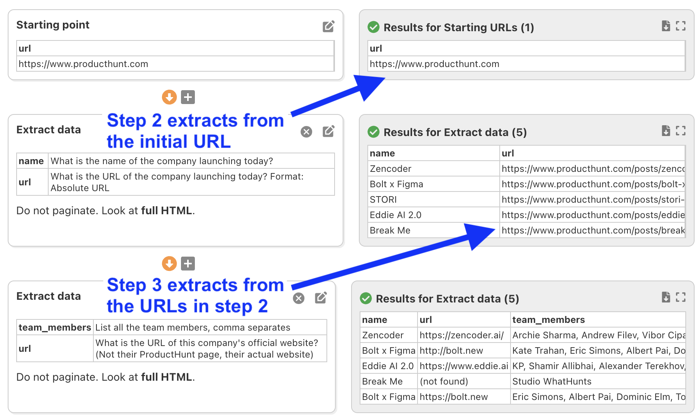
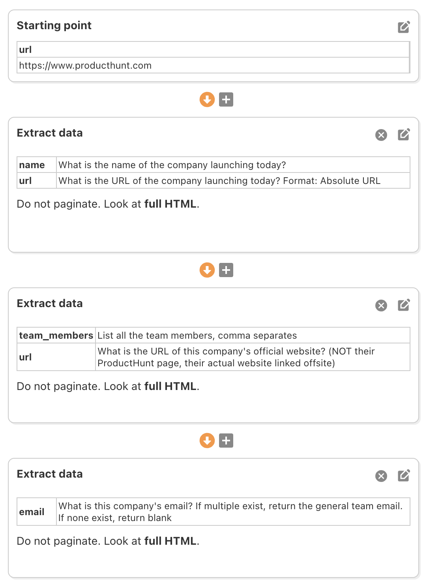

# 📡 Deep Scrapes

Sometimes, the data you want to scrape is not on your starting URL. Instead, it is one or more links away. This is called a deep scrape, and FetchFox offers powerful tools to handle this.

You can instruct FetchFox to follow links and combine data cross multiple levels in your scrape.

## Example: three levels deep to get emails

Let's start with an example. Suppose your goal is to find the emails of companies that launch on ProductHunt every day. The top companies are listed at https://www.producthunt.com, but the emails aren't there. To find the emails, you need to visit the company website. And to get the company website, you need to first visit the company profile on ProductHunt.

This is called a **three level scrape**, as you can see in the diagram below:

<figure><figcaption>
A three level scrape to find emails from ProductHunt
</figcaption></figure>

Each level of the scrape has different information available.

* The first level contains a list of companies that hit the frontpage of ProductHunt, and it also has the URLs of their profiles on ProductHunt.
* The second level has a lot more info, like an extended description of the company, the team members, and also a link to the official website.
* The third level is the company's official website. Company websites don't follow a standard format, but most startups list emails on the homepage. If it's there, FetchFox can find it.

This three level scrape is easy to do in FetchFox. Let's get to it.

## Building a three level deep scrape

Let's start with the first level. Navigate to https://fetchfox.ai, and enter the following prompt:

> https://www.producthunt.com
>
> Find the names and URLs of all the companies launching today

Click the button submit, and you should end up with a scraper like the one shown below.

<figure><figcaption>
The first level of our deep scrape
</figcaption></figure>

Click "Run" to test it out. I recommend putting in a low limit like 5, so that you don't waste too many credits. Your output will look something like this:

<figure><figcaption>
The results for the first level of the scrape
</figcaption></figure>

The scraper found two pieces of data: the company name, and their profile URL.

#### A two level deep scrape

Now, lets visit each profile page. Note that each row has a field called "url". This field is special. **When FetchFox sees a field named "url", the next step will scrape that page.**

On the profile page, lets get the name of the team, and also the official website. Add an extract step with the following fields:

* **team\_members:** List all the team members, comma separated
* **url:** What is the URL of this company's official website? (Not their ProductHunt page, their actual website)

Notice our prompt guidance for the AI on the url field. You should end up with a scraper that looks like this.

<figure><figcaption>
A two level scrape to find company name, website, and team members
</figcaption></figure>

When you click "Run", you'll get output that has the company name, it's website URL (if available), and the team members.

#### Get the emails with a three level deep scrape

The final step is to visit the company website, and look for emails. Notice how the "url" field in the results is now the company's official website. If you add an extract step, FetchFox will scrape data from that website. Many startups list their email on their homepage.

So, lets add an extract step with a field for email. Use this prompt:

* **email:** What is this company's email? If multiple exist, return the general team email. If none exist, return blank

Your final scraper should look like this:

<figure><figcaption>
Each level in this scraper gets data from a different page
</figcaption></figure>

The final output will combine the results from all three steps, and it will include any emails it finds.
