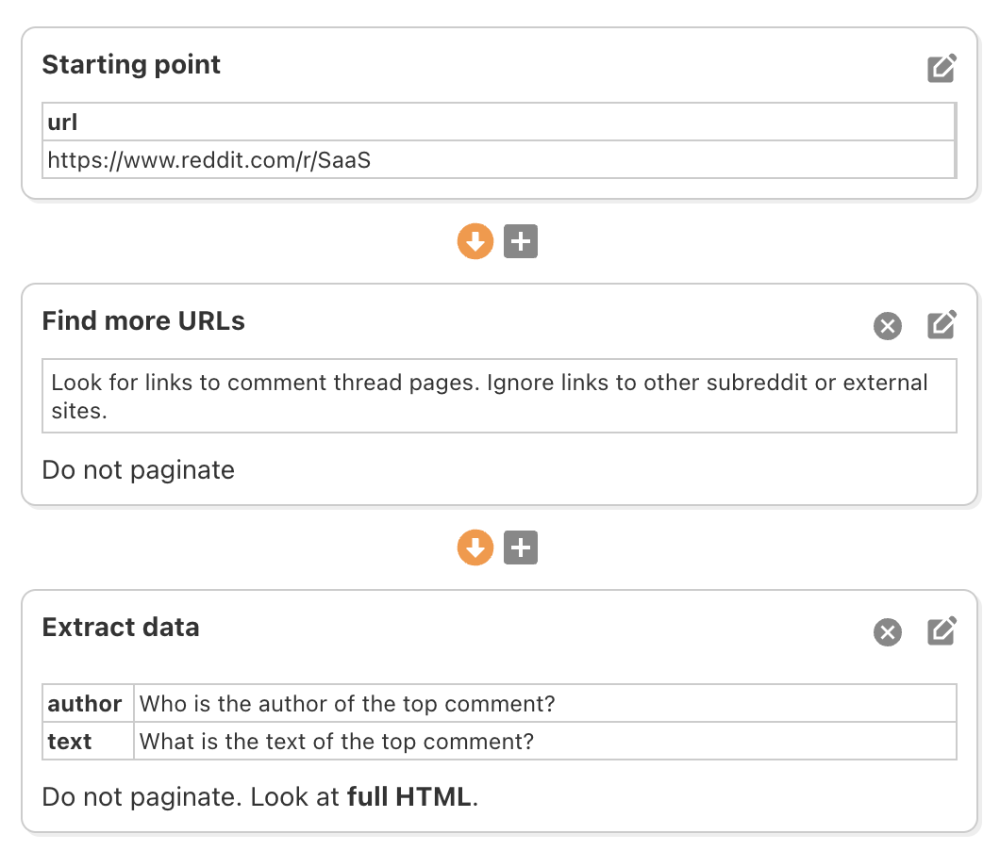
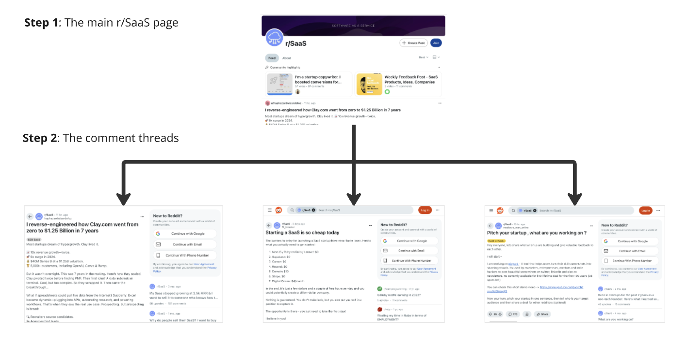
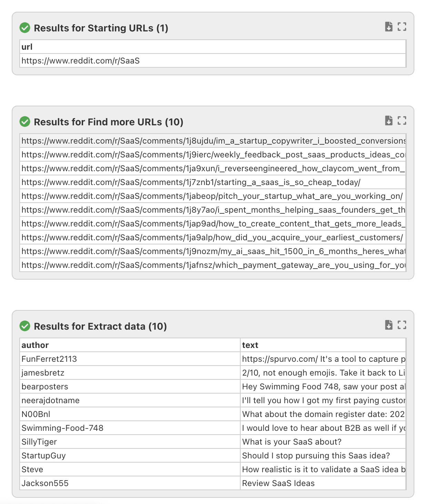

# Multiple Pages / Single Item per Page

This scraper setup gets goes to many different pages, and gets a single item from each one.

For example, let’s say you are scraping comment threads on a Reddit page like https://www.reddit.com/r/SaaS, and you want to get the text of the top comment on each thread. The comment text is not available on the main page, so FetchFox needs to visit the individual pages to get that data.

Let's start with a prompt that tells FetchFox to do this. Try the one below:

> https://www.reddit.com/r/SaaS
>
> Find the URL of each comment thread on this page, and then on each thread page get the author and text of the top comment.  Extract only the top comment.

FetchFox will generate a scraper like this:

<figure><figcaption></figcaption></figure>

This scraper starts on https://www.reddit.com/r/SaaS, and then visit each comment thread, as shown in the diagram below.

<figure><figcaption></figcaption></figure>

A single starting page goes to multiple thread pages. The results are shown below:

<figure><figcaption></figcaption></figure>

As you can see, FetchFox collected data from each comment thread.

TODO CLEAN UP OR REMOVE BELOW

From the previous topic, we added a field called ‘url’. This field has a special meaning. It tells FetchFox to open that page on the next step. This makes it to crawl many pages from a single&#x20;

<figure><figcaption></figcaption></figure>

Next, we need to add a new step called “Extract”. First, click the “+” icon (Add Step) after Step 2 (“Extract data”).

<figure><figcaption></figcaption></figure>

Then choose “Extract”.

<figure><figcaption></figcaption></figure>

Now add a field called “top\_comment” with a prompt “Find the top comment of each thread”. The next step is important because we only want the **top comment**, so let’s change the “Items per page” field to “Find exactly one item per page”.

<figure><figcaption></figcaption></figure>

Voila! Now you have a new column with the top comment for each thread page.

<figure><figcaption></figcaption></figure>

_Note_: This scraped data is from two different “types” of pages. Some of the data is from the top level (i.e. r/SaaS page) and the top comment data is the next level down.
